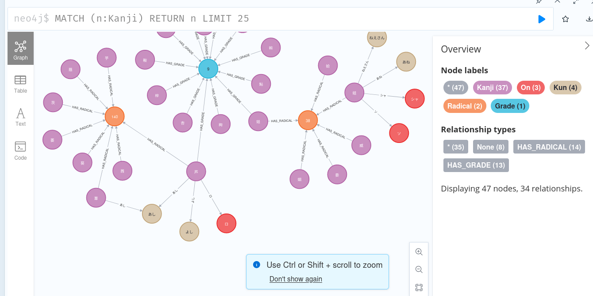

# Kanji Study Assistant
Build visualization forms to assist in studying the kanjis and how do they relate (including Graph DB, HTML and even txt).

 { style="width: 200px"}

Steps that the projects follow
- Setup Neo4j
- Download the kanjidic2.xml
- Access the kanjidic2.xml and collect a reduced version
- Process the reduced version
- Access and visualize the database and ensure expected outcome
- Process the full version
- Access the full database

## Setup
### Setup Neo4J
We need to spawn a neo4j instance to communicate with it
```
docker run --publish=7474:7474 --publish=7687:7687 --volume=$HOME/neo4j/data:/data neo4j
```
Afterwards we need to login to `http://localhost:7474/browser/` and set our username to `neo4j`
and password to `password` to match the one in the `Makefile`

For Windows machines, install Neo4J Desktop, and create a graph with the correct username and password.

### Download Source
The original data source is needed to collect the sample (reduced) database
and to be processed by the python transformer

```
make get_source
```

for Windows machines, download kanjidic2.xml from the [kanjidic2 project page](http://www.edrdg.org/wiki/index.php/KANJIDIC_Project)

### Python Environment
it's recommended to create a virtualenv and install the dependencies in it,
instead of installing the requirements globally by running

```
python -m virtualenv venv
source venv/bin/activate
# or venv\bin\activate.ps1 # for Windows powershell
# ensure that (venv) is now typed before the command line then run
python -m pip install -r requirements.txt
```


## Sample Testing (Access, Process and Collect)

It's a good option to process only a small portion first of the data source,
as processing the full database takes easily ~37 minutes.

Thus we'll need to access the `kanjidic2.xml` to create the sample `kanjidic2_reduced.xml`
before we start working with the full dataset, 

```
# Using an xslt collect a 100-entry kanjidic_reduced.xml
make trfilter
```

To process the data and produce the neo4js graph database for the sample
we would run

```
# deploy the graph db after lowering the production flag
make deploy_on_reduced
```

For further development it's helpful to peek into the database, for that we could use
xpaths, by usage of

```
# use an xpath with xmllint to filter and explore some queries
# that are used in developing the deploy targets
make xpath_radicals
```

Or we could create our own xslt files similar to the `gen/kanjidic.xslt` and capture
an html view as implemented throug the target

```
# Use an xslt to create an html view
make trkd
```

At this point to debug that we have correct generated output we may run

```
# use cypher-shell to interact with the graph database and show results from the CLI
make vis
```

Which should show an output that looks like

```
# | n                                                                                                                                                                |
# +------------------------------------------------------------------------------------------------------------------------------------------------------------------+
# | (:Kanji {ja_on: ["ア", "アイ", "ワ"], kanji: "娃", grade: "9", ja_kun: ["うつく.しい"], stroke_count: "9", heisig: "2200", heisig6: "2313"})                               |
# | (:Kanji {ja_on: ["ア", "オ"], kanji: "阿", grade: "9", jlpt: "1", ja_kun: ["おもね.る", "くま"], stroke_count: "8", heisig: "1295", heisig6: "1391"})                     |
# | (:Kanji {ja_on: ["アイ"], kanji: "哀", grade: "8", jlpt: "1", ja_kun: ["あわ.れ", "あわ.れむ", "かな.しい"], stroke_count: "9", heisig: "401", heisig6: "428"})                |
# | (:Kanji {ja_on: ["アイ"], kanji: "愛", grade: "4", jlpt: "2", ja_kun: ["いと.しい", "かな.しい", "め.でる", "お.しむ", "まな"], stroke_count: "13", heisig: "737", heisig6: "796"}) |
# | (:Kanji {ja_on: ["アイ"], kanji: "挨", grade: "8", ja_kun: ["ひら.く"], stroke_count: "10", heisig: "2248", heisig6: "1310"})                                          |
# +------------------------------------------------------------------------------------------------------------------------------------------------------------------+
#
# 5 rows
# ready to start consuming query after 7 ms, results consumed after another 1 ms
# +------------------------------+
# | n                            |
# +------------------------------+
# | (:Radical {rad_name: "38"})  |
# | (:Radical {rad_name: "170"}) |
# | (:Radical {rad_name: "61"})  |
# | (:Radical {rad_name: "64"})  |
# | (:Radical {rad_name: "162"}) |
# +------------------------------+
#
# 5 rows
# ready to start consuming query after 7 ms, results consumed after another 0 ms
# +----------------------------+
# | n                          |
# +----------------------------+
# | (:Grade {grade_name: "9"}) |
# | (:Grade {grade_name: "4"}) |
# | (:Grade {grade_name: "3"}) |
# | (:Grade {grade_name: "5"}) |
# | (:Grade {grade_name: "6"}) |
# +----------------------------+
```

## Production (Process)

To process the data and produce the neo4js graph database we may run

```
# Raise the production flag and start the conversion
# Caution: the following command could take ~37 minutes
make deploy
```

## Visualization (Access)
Final access is expected to be done through the GUI available on `http://localhost:7474/browser/`
By for example running `MATCH (n:Kanji) RETURN n LIMIT 25`  
  
  

In real scenarios, we are interested in knowing the kanjis that have the same reading,
for example to get all the characters that are pronounced "Waru" for the kunyumi reading
we could search for `MATCH (n:Kun where n.reading="こと") RETURN n LIMIT 25`  
  


## Note
It's possible to wipe the graph database between runs by uncommenting the line
`    #wipe_db(graph)` in `graphdb_converter.py`
